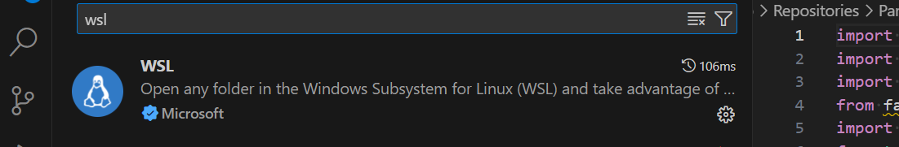

# Setup ROS Noetic on WSL2

### **Install WSL2 and Ubuntu 20.04**

1. **Enable and Install WSL2**  
   Open a Windows terminal (PowerShell or Command Prompt) as administrator and execute the following commands:

   ```bash
   wsl --install
   wsl --set-default-version 2
   wsl --install -d Ubuntu-20.04
   ```

   > **Note:** Once the Ubuntu distribution is installed, a new terminal window will automatically open to complete the setup (username, password, etc.).

2. **Launch Ubuntu**
   - Search for "Ubuntu 20.04" in the Windows search bar and launch it.
   - Alternatively, open a terminal and select "Ubuntu" from the dropdown menu.

     
   

---

### **Install ROS Noetic**

1. **Configure the ROS Repository**  
   Run the following commands to configure your system to receive packages from `packages.ros.org`:

   ```bash
   sudo sh -c 'echo "deb http://packages.ros.org/ros/ubuntu $(lsb_release -sc) main" > /etc/apt/sources.list.d/ros-latest.list'
   sudo apt install curl -y # Install curl if not already installed
   curl -s https://raw.githubusercontent.com/ros/rosdistro/master/ros.asc | sudo apt-key add -
   sudo apt update
   ```

2. **Install ROS**  
   ROS Noetic is available in three versions. Choose the one that suits your needs:

   - **Full version (all major packages):**
     ```bash
     sudo apt install ros-noetic-desktop-full
     ```
   - **Desktop version (without advanced tools):**
     ```bash
     sudo apt install ros-noetic-desktop
     ```
   - **Base version (minimal):**
     ```bash
     sudo apt install ros-noetic-ros-base
     ```

3. **Create a Catkin Workspace**  
   Run the following commands to create and configure a workspace:

   ```bash
   mkdir -p ~/catkin_ws/src
   cd ~/catkin_ws/
   sudo apt update
   sudo apt install build-essential -y
   catkin_make
   ```

4. **Avoid Manually Running the `source` Command Every Time**  
   Add the workspace setup to the `.bashrc` file for automatic execution:

   ```bash
   echo "source ~/catkin_ws/devel/setup.bash" >> ~/.bashrc
   source ~/.bashrc
   ```

   > **Note:** If you make changes to the workspace, you will still need to run the `source` command manually.

---

### **Integrate Visual Studio Code with WSL**

Visual Studio Code (VS Code) lets you edit and run code directly in your WSL environment using theWSL extension. 
This integration enables seamless access to Linux files, terminal commands, and tools while leveraging VS Code's features like extensions, debugging, and linting.

1. **Install Visual Studio Code on Windows**  
   Download and install [Visual Studio Code](https://code.visualstudio.com/) from the official website.

2. **Install the WSL Extension**  
   - Open Visual Studio Code.  
   - Press `Ctrl+Shift+X` to open the Extensions view.  
   - Search for and install the **"Remote - WSL"** extension.

3. **Use VS Code with WSL**  
   - Run the command `code .` from a WSL terminal to open the current directory in Visual Studio Code.  
   - Alternatively, navigate to the WSL partition via the Windows interface and edit the files directly in VS Code.

     